# AWS CLOUD SOLUTION FOR 2 COMPANY WEBSITES USING A REVERSE PROXY TECHNOLOGY

scope: to build a secure infrastructure inside AWS VPC, using Nginx reverse proxy and application load balancer (ALB) to direct traffic between a Wordpress CMS website (main) and a Tooling website. The set-up architecture should look like this:

### 1. CREATE A DOMAIN NAME

- Create a free domain name [link](https://www.namecheap.com/).

- Use Route 53 to set up a hosted zone mapped to your domain [link](https://www.youtube.com/watch?v=IjcHp94Hq8A).

**NOTE:** for every resource you create in this project always remember to add a name-tag and make sure to select the right vpc.

### 2. SET UP A VIRTUAL PRIVATE NETWORK (VPC)

- Turn on `Enable DNS hostnames` in you VPC settings.

- Create an **Internet gateway** and attach it to VPC.

- Create 6 subnets across two availability zones (AZs) 

    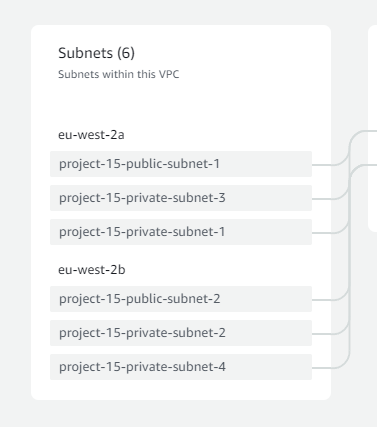

1. Create a **NAT gateway** - place it in a public subnet and associate it with an Elastic IP.

2. Create **public and private route tables (rtbs)** and associate them to the respective subnets.

    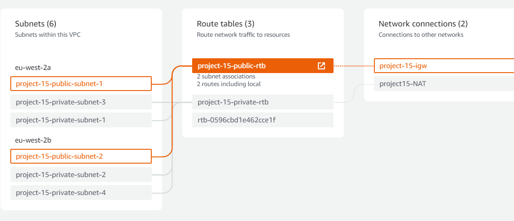

    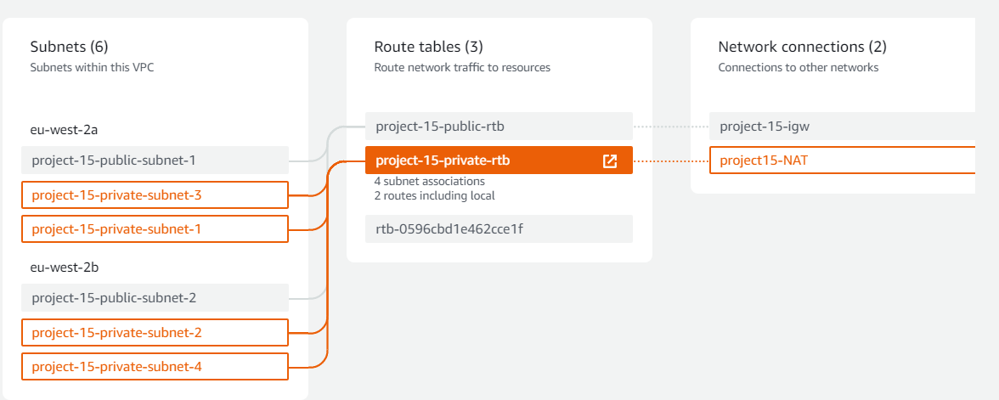

8. Edit routes:

    - public rtb: add a route so that every subnet associated to the this rtb can "talk" to the internet gateway from anywhere (but not vice-versa) 

    - private rtb: add a route so that every private subnet can access the internet from anywhere via the Nat gateway.

9. Security groups:

    - **External-LB**: allow access from anywhere in the internet.

        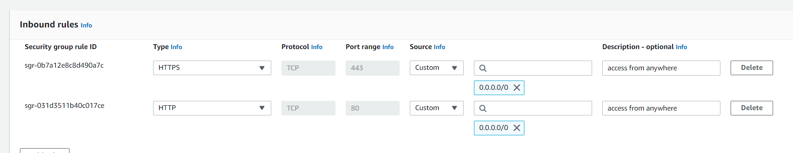

    - **Bastion**: allow SSH access from your workstation. 

        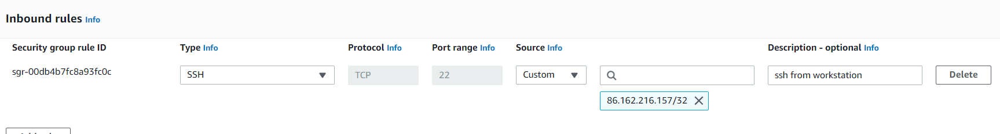

    - **Nginx reverse proxy**: allow access from  ELB and bastion (select source using security groups for bastion and ELB).

        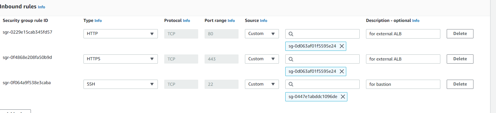

    - **Internal-LB**: allow access from Nginx proxy servers.

        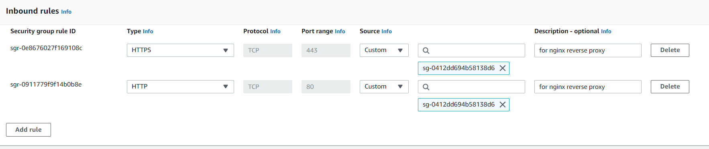

    - **Web-servers**: allow access from ILB and bastion.

        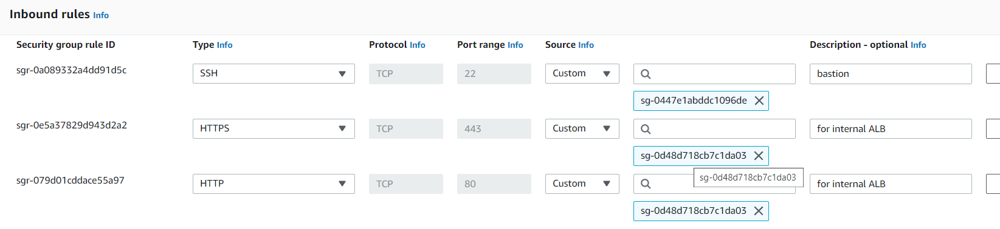

    - **Data-layer**: this is for databases and EFS
    
        - Allow access to databases only from web-servers and bastion.

        - Allow access to EFS mount-point for web-servers.

        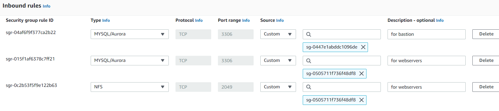

### 3. CREATE A CERTIFICATE FOR YOUR DOMAIN WITH AWS CERTIFICATE MANAGER (ACM)

- Request a public certificate.

- For commodity use a wildcard for your domain name e.g. if your domain name is thrive.com enter *.thrive.com - this means that any subdomain to your domain will have the certificate.

- Enable DNS validation and RSA encryption.

- Create a CNAME record in Route 53.

### 4. CREATE A FILE SYSTEM WITH AMAZON EFS

- Ensure mount targets are placed in private subnets and select appropriate security group

- Create two access points for the Wordpress and Tooling websites:

    - Set root directory path */wordpress* and */tooling* respectively,

    - set POSIX USER using root **UserID=0 GroupID=0**,

    - set **0755** permissions for root account.

### 5. CREATE AND SET-UP A DATABASE WITH AMAZON RDS

1. Create a key with AWS Key Management Service (KMS):

    -  Make the key symmetric, set it to encrypt and decrypt data, and select your account for key users and administrators.

2. Create subnet groups for your database in Amazon RDS:

    - Select VPC and both availability zones.

    - Select IP addresses for private subnets 3 and 4.

3. Create database - set master username and password, and associate it to appropriate security groups.

### 6. CREATE TARGET GROUPS

Create target groups for Tooling, Nginx, Wordpress and Bastion servers.

- Select "instances" as targets.

- Ensure that these protocols are enabled: 

     - Nginx: HTTPS port 443
     - Wordpress: HTTPS port 443
     - Tooling: HTTPS port 443
     - Bastion: TCP port 22

- Ensure that the health check path is `/healthstatus`.

- Register the relative instances as targets.

### 7. CREATE LOAD BALANCERS

1. External Application Load Balancer:

    - internet-facing
    - listens on HTTPS protocol
    - in appropriate AZ and public subnets
    - select ACM certificate for your domain name
    - select appropriate security groups
    - select Nginx instances as the target group
    - ensure that the health check path is `/healthstatus`

8. Internal Application Load Balancer:

    - listens on HTTPS protocol
    - in appropriate AZ and private subnets
    - select ACM certificate for your domain name
    - select appropriate security groups
    - ensure that the health check path is `/healthstatus`
    - select web-server instances as the target group:
        - one of the web-servers has to be set to default
        - configure a rule to forward requests to the other web-server: a good way to do this is with `Host header`, so if wordpress server is default when never the host header is tooling.domain.com or www.tooling.domain.com requests will be forwarded to the tooling server

        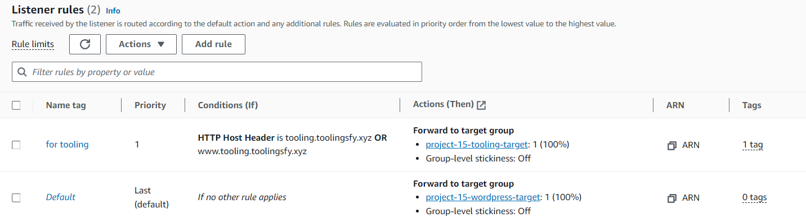

### 9. CREATE LAUNCH TEMPLATES

- Spin up 3 EC2 instances of RHEL 8 and for bastion, nginx and web-servers.

    `AMI: RHEL-8.6.0_HVM-20220503-x86_64-2-Hourly2-GP2 (ami-035c5dc086849b5de)`

- Refer to the notes is README.md to set up the resources and necessary certificates in each instance.

    [Self-signed certificate for Nginx and Apache](https://www.digitalocean.com/community/tutorials/how-to-create-a-self-signed-ssl-certificate-for-nginx-on-centos-7)

- Edit the ssl configuration file within the Apache server  `/etc/httpd/conf.d/ssl.conf`.

    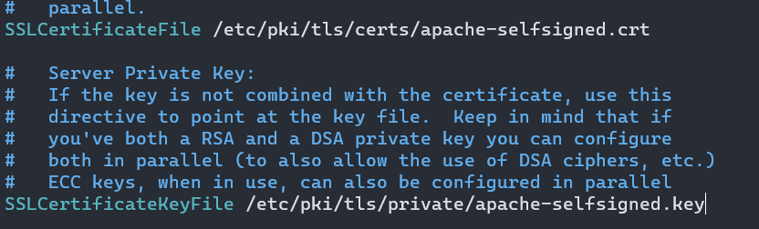

- Create an AMI out of each instance and make launch templates out of the AMIs. Paste the code in README.md in template userdata. For Nginx make sure you edit the `reverse.conf` with the right `server_name, ssl certificate and key paths, and DNS name for the ILB`

- Ensure that the Tooling and Wordpress templates are deployed in private subnets 1 or 2, and Nginx and Bastion templates in public subnets 1 or 2.

- Select the appropriate security group.

### 10. CREATE RECORDs IN ROUTE 53

Create `Alias` or `CNAME` records for your Wordpress and Tooling websites. Direct their traffic to the `ELB` DNS name.

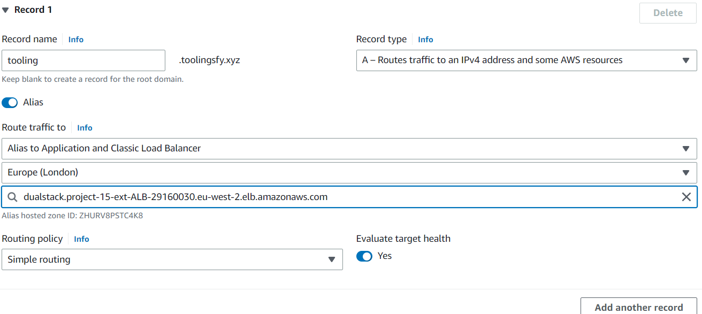

Create other records for www.tooling.domain.com and wordpress

### 11. CREATE AUTO-SCALING GROUPS

- Create auto-scaling groups for Wordpress, Tooling, Nginx and Bastion instances.

- Ensure to select the right template and security groups.

- AZ: Nginx and Bastion in public subnet 1 and 2 and web-servers in private subnets 1 and 2

- For Nginx and web-servers attach each auto-scaling group to the appropriate LB and turn on Elastic Load Balancing health checks

- Health check grace period: ensure there is enough time before a health check to allow instances to  update, download and initialize resources (such as Nginx) because otherwise it can lead to instances being tagged for failure and terminated 

- Set scale out if CPU utilization reaches 90%

- Ensure there is an SNS topic to send scaling notifications

Make sure that instances are  in a `healthy` state in each target group then head over to your websites from your browser. Ensure that your configuration is working for all websites and when you use a different host header e.g. www.wordpress.domain.com or wordpress.domain.com

